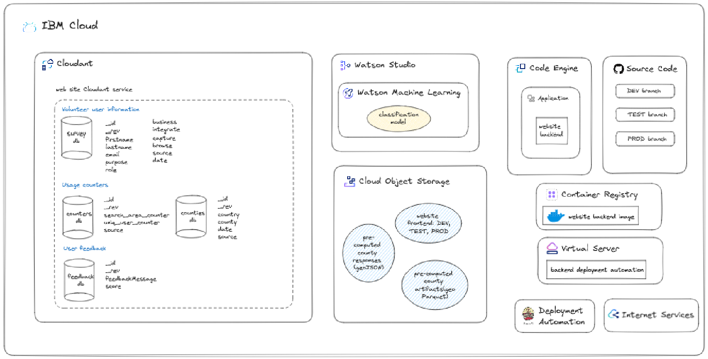

# SEforAll - Website
 
## Project description

The project's goal is to create accurate building footprint data sets using machine learning.
This will improve energy and infrastructure planning by identifying human activity, urbanization trends, and energy demand patterns, enabling more precise energy access initiatives.

The objective of this project also included creating a static website where this issue can be addressed for a specific area.
- [Website link](https://websitebucket.s3.eu-de.cloud-object-storage.appdomain.cloud/index.html)


## Goals

- Create a simple website with some interactive map
- Add an option to find a county or district from a list and automatically visualize all buildings belonging to the area on the map. Additionally, provide a short summary in a dedicated panel
- Ability to create custom specific polygon
- Ability to edit polygon and submit it
- Process the given polygon, send created polygon to database and find all buildings belonging to the chosen polygon
- Calculate and summarize all available data of found buildings, split them to residential and non-residential
- Visualize all buildings on the interactive map, providing details about selected buildings and provide a short summary in a dedicated panel
- Ability to submit custom polygons by uploading shapefiles and automatically visualize all buildings belonging to the custom polygon. Additionally, provide a short summary in a dedicated panel
-	Ability to compare details about two or more buildings
- Make the website simple and easy to use
- Provide a short summary about the data processing, website capabilities and active engagements
- Allow end users to provide feedback on the tool
- Allow end users to download building information for pre-defined areas of interest (such as countries, states or counties)
- Collect anonymous, aggregated usage information
- Collect voluntary profile information about end users

## Components

The entire structure of the website consists of two parts, the backend and the frontend described below.

### Backend

The main task of the backend part is to send requests to the database, and prepare the resulting data used in the frontend part. It also includes the configuration for Docker, which is needed to create an image, which is then needed for uploading to IBM Cloud.
In other words, the website backend image component is built into a Docker Image, which is then deployed to the Code Engine service on the IBM Cloud, where it runs continuously. You can see this components in [Figure 1](#website-components).
In this picture, we also see other components with which the backend communicates. Cloudant databases are used to store end user information or feedback as well as to track the key metrics of website usage.

More information about communication between backend and databases can be found in [Section Scenarios](#scenarios), providing an in-depth overview of the different workflows handled by the website.

The code governance and deployment automation is described in [Section Code Governance](#codegov).

<a id="website-components"></a>
<figure>
  
  <figcaption>Figure 1: This figure shows the individual components of the website as well as other components with which the website communicates. </figcaption>
</figure>

---

### Frontend

Please see the related repository for more details

## SEforALL API Documentation

This document provides an overview of the SEforALL API, which is designed to interact with four different endpoints. Each endpoint serves a specific purpose and accepts particular input data, returning results in compliance with OpenAPI 3.0.1 standards.

**API Link:** You can access the SEforALL API at the bottom of side panel on the [website](https://websitebucket.s3.eu-de.cloud-object-storage.appdomain.cloud/index.html).
### Endpoint 1: `/seforall/modelPredict`

**Description:**
This endpoint is used to call a machine learning (ML) model to predict the building class based on input images. The ML model classifies buildings into two categories:
- Confidence between 0 and 0.5 is labeled as 'non-res.'
- Confidence between 0.5 and 1 is labeled as 'res.'

**Request:**
- HTTP Method: POST
- Content-Type: application/json
- Request Body:
    - `country`: Name of country or state for choosing the right model for specific country.
    - `samples`: An array of images, where each image is represented as a 3D array of size 124x124 pixels, following by area_in_meters_ and smod_id separated by comma.

**Response:**
- HTTP Status Code 201: Successfully processed all inputs, and predictions are returned in the same order as received.
- Content-Type: application/json
- Response Body:
    - `predictions`: An array of numbers representing the confidence level of each image's classification, ranging from 0 to 1.

- HTTP Status Code 500: Indicates an error occurred.

### Endpoint 2: `/seforall/processPolygon`

**Description:**
This endpoint is used to prepare a GeoJSON response from a desired polygon defined by its boundary coordinates and country where is polygon located. The GeoJSON output will include the centroids of buildings that fall within the specified polygon boundaries. Additional building information will be included in the properties of the GeoJSON features.

**Request:**
- HTTP Method: POST
- Content-Type: application/json
- Request Body:
    - `country`: Name of country or state.
    - `polygon`: An array of polygon boundary coordinates represented as latitude and longitude pairs.
    

**Response:**
- HTTP Status Code 201: Indicates success, and a GeoJSON response containing building centroids and associated information has been created.
- Content-Type: application/json
- Response Body:
    - `GeoJSON`: A GeoJSON object conforming to the specified schema below.

- HTTP Status Code 500: Indicates an error occurred.

### Endpoint 3: `/seforall/processArea`

**Description:**
This endpoint is used to prepare a AreaGeoJSON response from an existing area defined by its uniq name. You can get all uniq names by Endpoint 4. The AreaGeoJSON output will include the centroids of buildings that fall within the specified area. Building information will be included in the properties of the GeoJSON features.

**Request:**
- HTTP Method: POST
- Content-Type: application/json
- Request Body:
    - `area`: An object representing the area uniq name.

**Response:**
- HTTP Status Code 201: Indicates success, and a AreaGeoJSON response containing building centroids and associated information has been created.
- Content-Type: application/json
- Response Body:
    - `GeoJSON`: An AreaGeoJSON object conforming to the specified schema below.

- HTTP Status Code 500: Indicates an error occurred.

### Endpoint 4: `/seforall/getAllAreaNames`

**Description:**
This endpoint is used to prepare JSON response which will include all area existing names.

**Request:**
- HTTP Method: GET
- Content-Type: application/json
- Request Body: For this GET request, the request body is empty. You do not need to include any data in the body of the request.


**Response:**
- HTTP Status Code 201: Indicates success, and all areas names JSON response is created
- Content-Type: application/json
- Response Body: The response body contains a JSON object mapping area names to their respective JSON files. These strict names for every area is possible use in processArea endpoint. 

- *Example:* when you want process with processArea endpoint area Narkhed, which is area in Maharashtra, then you should put in request India_Maharashtra_Nagpur_Narkhed. Notice that .json is not needed and country was added at the start of request.

```json
{
  "Kenya": {
    "Baringo": "Kenya_Baringo.json",
    "Muranga": "Kenya_Muranga.json",
    "...": "....json",
    "West_Pokot": "West_Pokot.json"
  },
  "Maharashtra": {
    "Nagpur": {
      "Narkhed": "Maharashtra_Nagpur_Narkhed.json",
      "...": "....json",
      "Bhiwapur": "Maharashtra_Nagpur_Bhiwapur.json"
    },
    "...": "....json",
    "Mumbai": "Maharashtra_Mumbai.json"
  }
}
```
- HTTP Status Code 500: Indicates an error occurred.

### GeoJSON Schema

The GeoJSON response is structured according to the following schema:

#### Properties

- **type**: A string indicating the type of GeoJSON object.
    - Type: `string`
    - Example: `FeatureCollection`

- **features**: An array of GeoJSON features, each representing a building.
    - Type: `array`
    - Items:
        - Type: `object`
        - **geometry**: Describes the geometry of the feature.
            - **type**: The type of geometry (e.g., Polygon).
                - Type: `string`
                - Example: `Polygon`
            - **coordinates**: An array of coordinates defining the geometry.
                - Type: `array`
                - Items:
                    - Type: `array`
                    - Items:
                        - Type: `number`
                        - Format: `float`
                - Example:
                  ```json
                  [
                    [
                      [ 74.96759906, 20.15104812 ],
                      [ 74.96760377, 20.15108595 ],
                      [ 74.9675744, 20.15108921 ],
                      [ 74.9675697, 20.15105138 ],
                      [ 74.96759906, 20.15104812 ]
                    ]
                  ]
                  ```

        - **id**: An identifier for the feature.
            - Type: `string`
            - Example: `building_123`

        - **properties**: Additional properties containing building information.
            - Type: `object`
            - **type_source**: Indicates the source of the building type.
                - Type: `string`
                - Example: `example_source`
            - **res_type**: Indicates if the building is 'res' (residential) or 'non-res' (non-residential).
                - Type: `string`
                - Example: `res`
            - **height**: The height of the building in meters.
                - Type: `number`
                - Format: `float`
                - Example: `50.0`
            - **area_in_meters**: The area of the building in square meters.
                - Type: `number`
                - Format: `float`
                - Example: `1200.0`
            - **latitude**: The latitude of the building.
                - Type: `number`
                - Format: `float`
                - Example: `40.7128`
            - **longitude**: The longitude of the building.
                - Type: `number`
                - Format: `float`
                - Example: `-74.0060`
            - **source**: The source of the building data (e.g., OSM).
                - Type: `string`
                - Example: `OSM`
            - **urban_split**: The urban split of the building (e.g., Urban).
                - Type: `string`
                - Example: `Urban`
            - **ghsl_smod**: The Global Human Settlement Layer (GHSL) settlement model (e.g., Urban Centre (City)).
                - Type: `string`
                - Example: `Urban Centre (City)`
            - **floors**: The number of floors in the building.
                - Type: `integer`
                - Example: `6`
            - **gfa_in_meters**: The Gross Floor Area of the building in square meters.
                - Type: `number`
                - Format: `float`
                - Example: `1384.1508`
            - **building_faces**: The number of faces or sides of the building.
                - Type: `integer`
                - Example: `4`
            - **perimeter_in_meters**: The perimeter of the building in meters.
                - Type: `number`
                - Format: `float`
                - Example: `60.76871025983301`
            - **osm_type**: The OpenStreetMap type of the building.
                - Type: `string`
                - Example: `building`
            - **elec_access_percent**: The percentage of the building with electrical access.
                - Type: `number`
                - Format: `float`
                - Example: `99.29711`
            - **elec_consumption_kwh_month**: The monthly electrical consumption in kWh.
                - Type: `number`
                - Format: `float`
                - Example: `1864.75745`
            - **elec_consumption_std_kwh_month**: The standard monthly electrical consumption in kWh.
                - Type: `number`
                - Format: `float`
                - Example: `12754137`
            - **confidence**: A float indicating the confidence level of the data.
                - Type: `number`
                - Format: `float`
                - Example: `0.85`

### AreaGeoJSON

#### Overview

`AreaGeoJSON` provides detailed information about geographic area and their buildings, including building properties.

#### Properties

- **type**: The type of GeoJSON object.
    - Type: `string`
    - Example: `FeatureCollection`

- **county_properties**: An object containing various properties of the county.
    - **count_of_buildings**: The total number of buildings in the county.
        - Type: `integer`
        - Example: `276`
    - **count_of_buildings_res**: The number of residential buildings.
        - Type: `integer`
        - Example: `270`
    - **count_of_buildings_nonRes**: The number of non-residential buildings.
        - Type: `integer`
        - Example: `6`
    - **square_area_of_county**: The total area of the county in square meters.
        - Type: `number`
        - Format: `float`
        - Example: `2643610.7330043577`
    - **square_area_of_buildings**: The total area covered by buildings in square meters.
        - Type: `number`
        - Format: `float`
        - Example: `12845.6225`
    - **square_area_res**: The total area covered by residential buildings in square meters.
        - Type: `number`
        - Format: `float`
        - Example: `12533.8118`
    - **square_area_nonRes**: The total area covered by non-residential buildings in square meters.
        - Type: `number`
        - Format: `float`
        - Example: `311.81070000000005`
    - **model_confidence_res**: Confidence level of the residential model.
        - Type: `number`
        - Format: `float`
        - Example: `0.7680004694835681`
    - **model_confidence_nonRes**: Confidence level of the non-residential model.
        - Type: `number`
        - Format: `float`
        - Example: `0.5443333333333333`
    - **height_avg**: The average height of buildings in meters.
        - Type: `number`
        - Format: `float`
        - Example: `3.0869565217391304`
    - **height_avg_res**: The average height of residential buildings in meters.
        - Type: `number`
        - Format: `float`
        - Example: `3.088888888888889`
    - **height_avg_nonRes**: The average height of non-residential buildings in meters.
        - Type: `number`
        - Format: `float`
        - Example: `3`
    - **county_polygon_coordinates**: Coordinates defining the boundary of the county.
        - Type: `array`
        - Items:
            - Type: `array`
            - Items:
                - Type: `number`
                - Format: `float`
        - Example:
          ```json
          [
            [ 74.97803832753728, 20.164466386635496 ],
            [ 74.97590477124531, 20.16407459223873 ],
            [ 74.97300590782348, 20.16367416104174 ],
            [ 74.96998782179375, 20.163621667309616 ],
            [ 74.96835686571674, 20.163676641910055 ],
            [ 74.96599862909409, 20.163564931963588 ],
            [ 74.96122937263941, 20.162654987998426 ],
            [ 74.96219422433998, 20.16026063778382 ],
            [ 74.96406253777295, 20.156894850519254 ],
            [ 74.96502765717148, 20.15512386795777 ],
            [ 74.96450888817974, 20.15116751080463 ],
            [ 74.96442192407372, 20.14970860026088 ],
            [ 74.96641577257606, 20.14879523420568 ],
            [ 74.97009800734986, 20.147935234694817 ],
            [ 74.97486586782261, 20.1473048142768 ],
            [ 74.97844338149214, 20.147510542029295 ],
            [ 74.97861165930105, 20.148901625664173 ],
            [ 74.98012284839116, 20.14867041653631 ],
            [ 74.98018643563853, 20.15083833981135 ],
            [ 74.97752729573509, 20.15089861079854 ],
            [ 74.97807645113964, 20.156887437949425 ],
            [ 74.97803832753728, 20.164466386635496 ]
          ]
          ```
    - **rural**: An integer indicating some rural attribute.
        - Type: `integer`
        - Example: `276`

- **features**: An array of features within the area.
    - Type: `array`
    - Items:
        - Type: `object`
        - **type**: The type of GeoJSON feature.
            - Type: `string`
            - Example: `Feature`
        - **properties**: Properties of the feature.
            - **latitude**: Latitude coordinate of the feature.
                - Type: `number`
                - Format: `float`
                - Example: `20.15106866`
            - **longitude**: Longitude coordinate of the feature.
                - Type: `number`
                - Format: `float`
                - Example: `74.96758673`
            - **height**: Height of the feature in meters.
                - Type: `number`
                - Format: `float`
                - Example: `3`
            - **area_in_meters**: Area of the feature in square meters.
                - Type: `number`
                - Format: `float`
                - Example: `13.0346`
            - **classification_type**: Classification type of the feature (e.g., 'res').
                - Type: `string`
                - Example: `res`
            - **classification_source**: The source of the classification (e.g., 'area').
                - Type: `string`
                - Example: `area`
            - **footprint_source**: The source of the footprint data (e.g., 'google').
                - Type: `string`
                - Example: `google`
            - **urban_split**: The urban split classification (e.g., 'Rural').
                - Type: `string`
                - Example: `Rural`
            - **ghsl_smod**: The GHSL settlement model classification.
                - Type: `string`
                - Example: `Very Low Density Rural Grids (Mostly Uninhabited Area)`
        - **geometry**: Geometrical data of the feature.
            - **type**: The type of geometrical data.
                - Type: `string`
                - Example: `Polygon`
            - **coordinates**: Coordinates defining the geometry.
                - Type: `array`
                - Items:
                    - Type: `array`
                    - Items:
                        - Type: `number`
                        - Format: `float`
                - Example:
                  ```json
                  [
                    [
                      [ 74.96759906, 20.15104812 ],
                      [ 74.96760377, 20.15108595 ],
                      [ 74.9675744, 20.15108921 ],
                      [ 74.9675697, 20.15105138 ],
                      [ 74.96759906, 20.15104812 ]
                    ]
                  ]
                  ```

For further details, refer to the API documentation for the SEforALL API.

## License

Copyright 2022-2023 SE4ALL

UNDER CONSTRUCTION: Add licence
